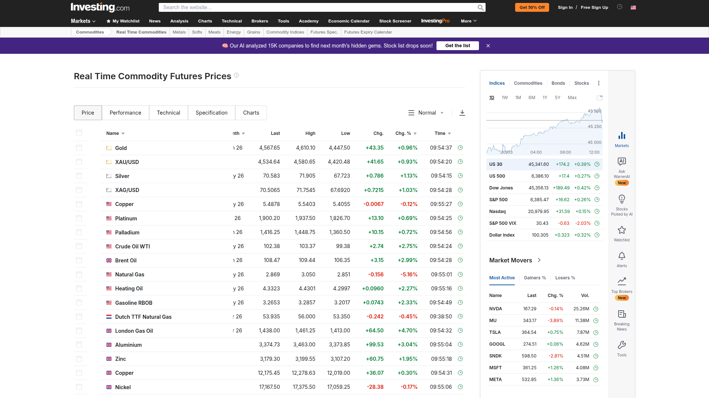
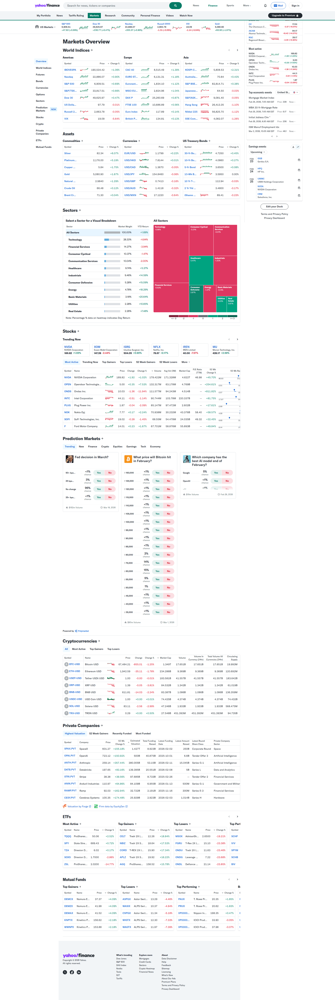
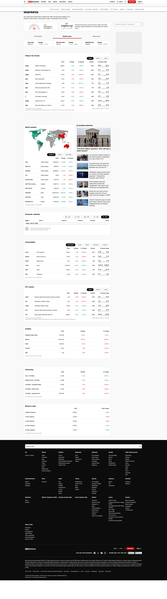

# Design Improvement: Gasoline World Dashboard

## TL;DR
Три изменения с максимальным эффектом: **sparklines на карточках стран**, **ценовой бар относительного позиционирования** и **апгрейд шапки статистики** — превратят добротный дашборд в топовый финансовый инструмент.

---

## Текущее состояние
*Тёмный дашборд с мировыми ценами на топливо. Шапка с логотипом и переключателями → 4 стат-карточки → карта мира → калькулятор → фильтры → сетка карточек стран / таблица → раздел прогноза и новостей.*

---

## Идеи улучшений

### 1. Sparklines на карточках стран ⭐ (наибольший эффект)

**Что изменить:** В каждую карточку страны и строку таблицы добавить маленький sparkline-график (60×24px) прямо рядом с ценой. Данные уже есть в `forecast.js` — 24-месячный прогноз для каждой страны.

**Вдохновение:**

*Investing.com — каждый товарный фьючерс сопровождается мини-графиком тренда [Lazyweb]*


*OpenSea — тёмная таблица коллекций с sparkline-колонкой для визуализации изменения цены [Lazyweb]*

**Почему это работает:** Цена без тренда — это просто число. Sparkline за 2 секунды отвечает на вопрос "куда движется?" без лишних кликов. Investing.com и OpenSea используют эту механику именно потому, что она мгновенно передаёт динамику.

**Скетч:**
```
┌──────────────────────────────────────┐
│ 🇩🇪  Германия           Европа       │
│                                      │
│  $1.82 /л    ╱╲    ↑ +2.1%           │
│            ╱    ╲╱  [sparkline 8w]   │
│                                      │
│  [⚡ В калькуляторе]  [🔔]            │
└──────────────────────────────────────┘
```

---

### 2. Ценовой бар относительного положения

**Что изменить:** Под ценой на каждой карточке — тонкая горизонтальная полоса (4px), которая показывает, где эта страна находится в мировом диапазоне (от самой дешёвой до самой дорогой). Маркер на полосе = позиция страны.

**Вдохновение:**

*Phantom — тёмный маркет-обзор с цветовыми индикаторами относительного положения активов [Lazyweb]*

**Почему это работает:** Пользователю не нужно сортировать или сравнивать числа вручную — он мгновенно видит "эта страна в дешёвой трети" или "почти максимум". Это снижает когнитивную нагрузку.

**Скетч:**
```
┌──────────────────────────────────────┐
│ 🇩🇪  Германия                        │
│  $1.82 /л                            │
│                                      │
│ Дёшево ██████████████░░░░ Дорого     │
│         ▲ (позиция в мировом ряду)   │
└──────────────────────────────────────┘
```

---

### 3. Апгрейд секции статистики — live-тикер стиль

**Что изменить:** Заменить 4 статичные карточки статистики на горизонтальный тикер-бар — узкую полосу под шапкой с анимированными данными: самая дешёвая страна + цена, самая дорогая, среднее по миру, количество стран. Добавить цветные дельта-стрелки (↑ ↓) показывающие изменение относительно прошлого периода.

**Вдохновение:**

*Yahoo Finance — горизонтальный бегущий тикер ключевых индексов прямо под хедером [Lazyweb]*


*CNN Markets — компактная статистическая полоса с основными рыночными показателями [Lazyweb]*

**Почему это работает:** Тикер занимает меньше вертикального пространства, чем 4 карточки, но при этом воспринимается как "живой" — это сразу создаёт ощущение реального финансового инструмента, а не статичного справочника.

**Скетч:**
```
┌──────────────────────────────────────────────────────┐
│ ⬇ Дешевле: Венесуэла $0.025  |  ≈ Среднее: $1.24  │
│ ⬆ Дороже: Норвегия $2.31     |  🌍 187 стран        │
└──────────────────────────────────────────────────────┘
```

---

### 4. Карта: тепловая заливка вместо трёх цветов

**Что изменить:** Сейчас страны на карте красятся в 3 цвета по жёстким порогам ($0.50 и $1.50). Заменить на плавный цветовой градиент от зелёного (минимум) до красного (максимум) — choropleth map. Цвет вычисляется динамически по реальному диапазону данных.

**Вдохновение:**

*Kpler — тёмная карта глобальных товарных потоков с градиентной цветовой шкалой [Lazyweb]*

**Почему это работает:** 3 цвета теряют нюансы — Германия ($1.82) и Норвегия ($2.31) выглядят одинаково (красные), хотя разница большая. Градиент передаёт относительность мгновенно.

**Скетч:**
```
  Легенда:  $0.02 ──────────────────── $2.40
            🟢 зелёный → 🟡 жёлтый → 🔴 красный
            (позиция каждой страны на градиенте)
```

---

### 5. Всплывающий тултип на карте с мини-карточкой

**Что изменить:** При наведении на страну на карте показывать не просто название+цену, а полноценный мини-попап: флаг, название, цена бензина, цена дизеля, регион, кнопка "Открыть в калькуляторе". Это избавит от необходимости скроллить вниз после клика на карте.

**Скетч:**
```
          ┌─────────────────────────┐
          │ 🇩🇪  Германия  • Европа │
          │ ⛽ Бензин:  $1.82/л     │
          │ 🛢 Дизель:  $1.71/л     │
          │ [⚡ В калькулятор →]    │
          └─────────────────────────┘
```

---

## Что уже работает хорошо

- **Цветовое кодирование цен** (зелёный / янтарный / красный) интуитивно понятно с первого взгляда
- **Двойной режим отображения** (карточки + таблица) — правильное решение для разных сценариев использования
- **Шрифтовая пара** Bebas Neue + JetBrains Mono создаёт отличный технический характер
- **Тёмная тема с оранжевым акцентом** выглядит профессионально и уместно для финансового инструмента
- **Калькулятор** — killer feature, хорошо интегрирован с картой

---

## Все референсы

| Скриншот | Источник | Что применено |
|----------|----------|---------------|
| `investing-sparklines.png` | Investing.com [Lazyweb] | Идея #1 — sparklines |
| `opensea-table-sparklines.png` | OpenSea [Lazyweb] | Идея #1 — sparklines в таблице |
| `phantom-market-table.png` | Phantom [Lazyweb] | Идея #2 — ценовой бар |
| `yahoo-finance-dashboard.png` | Yahoo Finance [Lazyweb] | Идея #3 — тикер статистики |
| `cnn-world-markets.png` | CNN Markets [Lazyweb] | Идея #3 — live stats bar |
| `kpler-commodity-map.png` | Kpler [Lazyweb] | Идея #4 — градиент карты |
